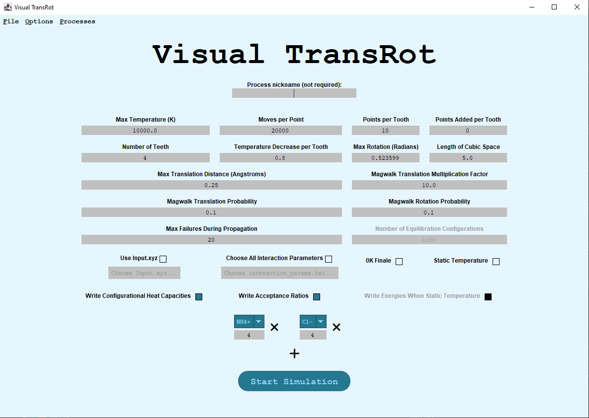
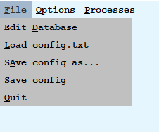

# Visual TransRot


Visual TransRot (VTR) is a Graphical User Interface (GUI) built for the visual configuration and use of [TransRot](https://github.com/steventopper/TransRot/tree/main).
Visual TransRot is written in Java using the [Swing](https://en.wikipedia.org/wiki/Swing_(Java)) GUI toolkit for interface development.
It interfaces directly with a packaged version of TransRot, which is internally executed to allow for independently running TransRot calculation processes.

## Using VTR

### OS Support
VTR supports execution on all three major operating systems (Windows, MacOS, Linux) and TransRot has been tested on:
- *Windows*: `Windows 10`, `Windows 11`
- *MacOS*: `El Catalina`, `Monterey`, `Ventur`, `Sequoia`
- *Linux*: `Ubuntu`

### Prerequisites
Visual TransRot requires an installed Java Development Kit (JDK) of version 1.11.0 or newer. The most up-to-date JDK can be found at https://www.oracle.com/java/technologies/downloads.

### Running VTR
To simply use VTR on a system:
1. Download the OS-specific package from [the latest release](../../releases/latest) and extract its files.
2. Either double click `vtr.jar` in your native file viewer, or use
    ```
    java -jar vtr.jar
    ```
    in the extracted directory to run VTR.

### Contributing to VTR
To contribute to VTR, first clone the GitHub repository. All code is written in Java and requires JDK>=11 to compile. The Main method is located in [Main.java](src/Main.java).

If manually compiled, `saved_config.txt`, `saved_dbase.txt`, `TransRot.jar`, and `wrapper.jar` must be placed to be siblings of the compiled output directory.

## Features & Capabilities
### Process Nickname


VTR allows the user to define a nickname for each created process if desired, which will be displayed in the [Process Monitor](#process-monitor) to identify the process. Name must be unique from all other nicknames being currently ued in the Monitor.

If no nickname is specified for a process, its unique Process ID is used by default.

### Config


VTR exposes complete user control over the values of the [20 configuration variables used in TransRot](https://github.com/steventopper/TransRot/tree/main#how-to-customize-run-parameters).
These variables include integer, decimal, and boolean inputs to allow complete control over TransRot runs.
When a run has been started or the configuration is saved by the user, [saved_config.txt](saved_config.txt) is updated automatically to reflect any configuration changes to be used during runs of TransRot.

Beyond allowing basic editing of configuration variables, the config interface supports several more advanced features to increase usability of TransRot:

- **Numeric Validation** - All numeric inputs to VTR are automatically validated to ensure variables only accept numeric inputs.
  - Certain numeric inputs are also accompanied byu predefined minimum and maximum acceptable values. This minimum value is 0 for all variables except `Points per Tooth` and `Max Failures During Propagation`, which both have minmum values of 1.
    The only four variables with maximum values are `Temperature Decrease per Tooth` (1), `Magwalk Translation Probability` (1), `Magwalk Rotation Probability` (1), and `Max Rotation (Radians)` (2π).
      
- **Conditional Variables** - A number of conditions have been defined, wherein the status (enabled/disabled) of an input is dependent on the value of a boolean input. Disabled variables are grayed out in VTR and are not used in TransRot runs. A list of these conditions is as follows; if not disabled according to one of the following rules, each variable will be enabled:
  - When `Static Temperature` is *true*, `Points per Tooth`, `Points Added Per Tooth`, `Number of Teeth`, `Temperature Decrease per Tooth`, and `0K Finale` are all disabled.
  - When `Static Temperature` is *false*, `Write Energies When Static Temperature` is disabled.
  - When either `Static Temperature` or `Write Configurational Heat Capacities` is *false*, `Number of Equilibration Configurations` is disabled.
  
- **Use Input.xyz** - The `Use Input.xyz` variable provides a more complex functionality than other boolean variables.
  - When `Use Input.xyz` is selected, a 'Choose Input.xyz' button is enabled. Clicking this allows selection of a file to be used as Input.xyz in runs of TransRot. Selected files must be of the proper format, described in [TransRot's README.md](https://github.com/steventopper/TransRot/tree/main#use-input).
  - When `Use Input.xyz` is selected, [Molecule Counts](#molecule-counts) are removed from the interface.
  
### Molecule Counts


When no `.xyz` file is being used, the Molecule Counts section of VTR's interface is shown. This section allows the user to select the types and counts of molecules to simulate in a run of TransRot.
Limitations in the interface only allow moleculed defined in the [Database Editor](#database-editor) to be used, and do not allow any molecule type to be used more than once for consistency.

### Settings Menu


VTR exposes a number of options and features through the Settings Menu in the upper left corner. All settings located in the Settings Menu can be accessed by alt-shortcuts (shown by underlined characters in settings) or through CTRL shortcuts in parentheses.
- #### `File`
  - `Edit Database` *(CTRL+D)* - Opens the [Database Editor](#database-editor).
  - `Load config.txt` *(CTRL+L)* - Opens a selector to open a configuration file & loads it into settings.
  - `Save config as...` *(CTRL+A)* - Allows to user to select a location to save TransRot configuration to.
  - `Save config` *(CTRL+S)* - Saves the current configuration to saved_config.txt.
  - `Quit` *(CTRL+Q)* - Closes VTR.
- #### `Options`
  - `Set outut directory` *(CTRL+Y)* - Allows the user to select a location to create TransRot output directories in. Defaults to be local to the running location of VTR.
  - `Show output directory` *(CTRL+W)* - Shows the current output directory in the OS-native file viewer.
- #### `Processes`
  - `Monitor processes` *(CTRL+M)* - Opens the [Process Monitor](#process-monitor).

### Database Editor


Besides a configuration file, TransRot requires a `dbase.txt` file to be used to define any molecules used as part of configuration.
In VTR, this file reads and writes to [saved_dbase.txt](saved_dbase.txt) for data persistence between uses of VTR.

To edit the database used for TransRot calculations, a visual editor can be opened through menu navigation (`File > Edit Database`) or using *CTRL+D*.

The Database Editor interface allows a user to load an existing dbase file, add or remove particles or atoms, and save the database (either to saved_dbase.txt or another location).

In its default state, [saved_dbase.txt](saved_dbase.txt) is populated with a sample database with particle definitions for `NH4+`, `CL-`, and `H2O (using TIP3P)`.
If any of these particles need to be modified, removed, or added to, the Database Editor interface provides multiple options to do so.

#### Adding/Removing Particles and Atoms

- At the top of the interface there is an 'Add Molecule' button, which will create a new empty particle at the bottom of the database.
- Similarly, 'Clear Molecules' will clear the database in its current state.
- The delete icon next to a particle's name and radius will remove the individual particle's definition.
- Each particle is accompanied by an 'Add Atom' button, which will append a new empty atom to the particle.
- To delete an atom, use the delete icon at the end of its definition.

#### Editing Particles and Atoms

- Each particle is defined by its name, an estimated radius, and a list of associated atoms.
  - All particle names must be unique in order for the database to be saved.
- Each atom is defined by its name, position, 5 interaction parameters ([A, B, C, D, and Q](https://github.com/steventopper/TransRot/tree/main#how-to-add-new-molecules-to-the-database)), and mass.
  - VTR allows two types of atoms: predefined atoms and 'ghost' atoms, which have no mass.
  - All defined atoms are pre-loaded as options for an atom's type, with each associated with a pre-defined atomic mass.
  - Selecting the 'Ghost' option for an atom allows a user to specify its name separately and marks said atom as a massless interaction point for TransRot.
  - The C and D parameters can also be defined in terms of σ and ϵ, as defined in https://github.com/steventopper/TransRot/wiki/Noble-gas-clusters-1:-Adding-noble-gases-to-TransRot. If this calculation is desired, selecting 'Calculate C & D' for a given atoms allows the user to calculate C and D based off of these new parameters.

#### Loading & Saving a Database

VTR can both load and save database files to allow batch uploading/downloading of particles.

- Selecting 'Load Database' allows the user to select a `.txt` file to be loaded into VTR. Any properly formatted molecules from this file are appended onto existing molecules already in VTR.
- Selecting 'Save Database' saves the current state of the database in VTR to saved_dbase.txt. No changes are committed to the file until the database has been saved. When the database window is closed, there is also an opportunity to save if desired.
- Selecting 'Save Database As...' allows the user to select a new location to save the current database file to for use elsewhere. Using this feature will not save the database to saved_dbase.txt for use by VTR without additionally saving independently.

### Process Monitor


When a TransRot calculation is initiated from within VTR, an independent process is launched to increase the multiprocessing benefit of keeping processes decoupled.
This feature means that TransRot processes can be run from within VTR, the interface process can be closed, and the calculation will continue running in the background.

Because of the possibility of numerous processes being executed simultaneously from VTR, a Process Monitor is available to keep track of these runs.
The Process Monitor keeps track of the status, execution time, logs, and output of all processes from the time of their generation until they are manually dismissed within the monitor.

The Process Monitor and Process Views are always-on-top for compatible OSs.

Besides Process Entries, the Process Monitor includes 2 buttons: The `Dismiss Process/End Task` button either ends the currently selected process or removes it from the Monitor, depending on its status. `Dismiss All Completed Processes` removes all processes with statuses other than `Processing` from the Monitor.

Once a process is removed from the Process Monitor, it cannot be added back.

#### Monitor Entries

Each individual process in the Process Monitor displays the following details: Process ID (PID), Process Name, Started At, Elapsed Time, and Status.
- `PID` - Each process is associated with an OS-specific process ID, which can be used to distinguish all processes running currently on a system. A currently running process exposes some details on its current status to the host OS, and often can be used to externally kill the process.
- `Process Name` - This is either a custom nickname associated with each process in the [Process Nickname](#process-nickname) section, or defaults to using a unique name containing the process's PID. Each `Process Name` currently on the Process Monitor must be unique.
- `Started At` - A timestamp of the start time of the process, which can also be used for distinguishing purposes.
- `Elapsed Time` - The elapsed time of currently running processes are updated live in the Process Manager to keep track of runtime in realtime; completed processes display this information from TransRot's `elapsed_time.log` output file.
<a id="status"></a>
- `Status` - The status of a process is one of 4 options, which are grouped by default in the Process Monitor:
  - `Processing` indicates that the processes is currently executing, and the `Elapsed Time` shown can be used to view its live execution time.
  - `Run completed` indicates that a run has successfully finished and its [output files can be accessed](#output-files).
  - `Run terminated early` indicates that an error occurred sometime during the execution of TransRot, after a directory has been created for it. This error can be viewed by [checking error logs](#error-logs).
  - `Process failed to start` indicates that a TransRot run could not start and no output directory is associated with it. Typically, this occurs when a uniquely named directory cannot be created for the process in the save location.
  
Additionally, each process has a link reading 'View logs & other details'. Clicking this link on a process opens a [Process View](#process-view) for the run.

### Process View

The Process View provides a user with more detailed information about a TransRot process than the Process Monitor.

While a process is executing, 4 tabs are shown: `Process Info`, `Config`, `Output Log`, and `Error Log`. Additionally, the process's unique name is displayed and a button to end the process is exposed.
When the process is terminated either automatically or manually, an `Output` tab is created, and the 'End Process' option is removed.

#### `Process Info`


The `Process Info` tab includes more detailed information about a process, including:
- **Status** - The current status of the process, as defined [earlier](#status). Status is updated in real time.
- **Start Time** - The formatted timestamp when the process was initiated.
- **Elapsed Time** - A live timer of the process's runtime.
- **Output Directory** - A link to the output directory of the specific process. Clicking this link opens said directory in the OS-native file viewer.
- **Molecules Simulated** - Contains the [Molecule Counts](#molecule-counts) used for this process's TransRot calculation.
- **Load config with values** - Selecting this automatically loads the process's entire configuration directly into VTR's main interface for use in new runs.

#### `Config`


The `Config` tab lists all 20 configuration variables used in TransRot and the values used for them in the calculation.

#### `Output Log`


The `Output Log` tab displays a live feed of the calculation's logs. These are the same logs displayed if TransRot were run as a standalone process in a terminal.

#### `Error Log`


The `Error Log` tab displays a live feed of the calculation's error log. This tab will only be populated if an error occurs before or during the TransRot calculation.

#### `Output`


The `Output` tab is shown when a process is completed. It displays a list of all files output by TransRot, which are automatically created in the process's **Output Directory**.

All displayed file names are links, and clicking on these will open the file in the host OS, using whatever program is associated with the filetype.
All intermediate and final output `.xyz` files are accompanied by a 'Use as Input.xyz' button. Clicking this will enable the 'Use Input.xyz' variable in VTR, and populate the input automatically with the associated file.

## Licensing Information

Visual TransRot is licensed under the [TransRot License](https://github.com/steventopper/TransRot/tree/main#licensing-information), an extension of All Rights Reserved.